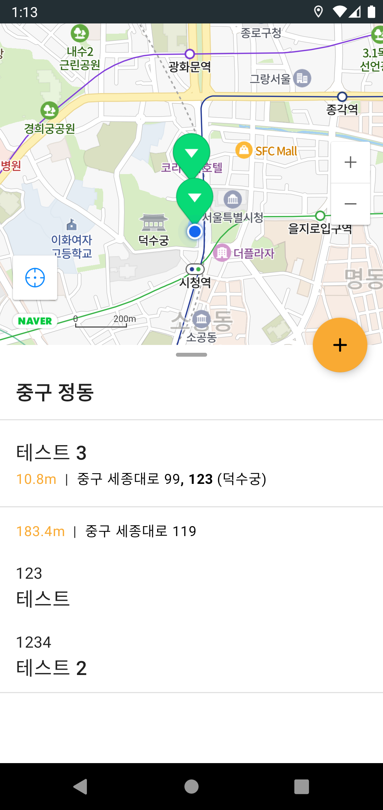
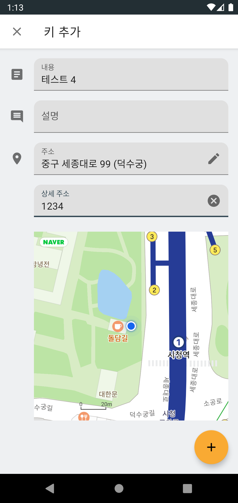
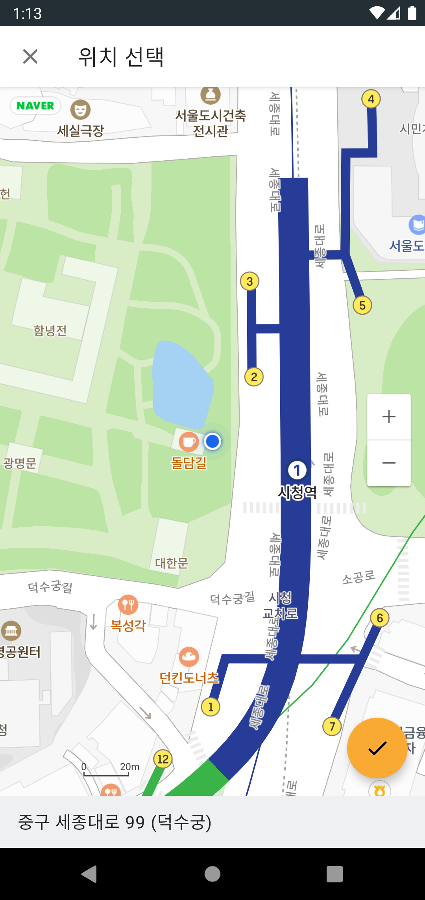

<h1 align="center">key-map</h1>

<p align="center">
    
    
</p>

<p align="center">
key-map is provide key (notes) by location.
</p>

## Preview

<p align="center">
    
    
    
</p>

## Architecture

MVVM (View - ViewModel - Model)

## Built with

- [Kotlin](https://kotlinlang.org/) based, [Coroutines](https://github.com/Kotlin/kotlinx.coroutines) + [Flow](https://kotlin.github.io/kotlinx.coroutines/kotlinx-coroutines-core/kotlinx.coroutines.flow/) for asynchronous.
- [Material-Components](https://github.com/material-components/material-components-android) - Material design components like ripple animation, cardView.
- JetPack
  - ViewModel & LiveData
  - App Startup
- [Dagger Hilt](https://dagger.dev/hilt/) for dependency injection.
- [Cronet](https://developer.android.com/guide/topics/connectivity/cronet?hl=ko) for networking
- [Firebase](https://firebase.google.com/)
- [Naver Map](https://navermaps.github.io/android-map-sdk/guide-ko/1.html)
- [Bundler](https://github.com/skydoves/bundler) - Android Intent & Bundle extensions that insert and retrieve values elegantly.
- [Epoxy](https://github.com/airbnb/epoxy) - Android library for building complex screens in a RecyclerView.

## MAD Score


## License

```
Copyright 2020-2021 Namhyun, Gu

Licensed under the Apache License, Version 2.0 (the "License");
you may not use this file except in compliance with the License.
You may obtain a copy of the License at

   http://www.apache.org/licenses/LICENSE-2.0

Unless required by applicable law or agreed to in writing, software
distributed under the License is distributed on an "AS IS" BASIS,
WITHOUT WARRANTIES OR CONDITIONS OF ANY KIND, either express or implied.
See the License for the specific language governing permissions and
limitations under the License.
```